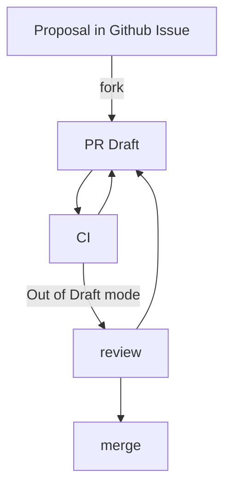

# Contributing

New feature, bug fix, new language, new howto, typo fix; everything is fine.

> If you want to participate in this project, you are welcome to start by translating/writing documents.

## Basic principles

### Target user

- Self-hosting(as app, with docker container)
- Developers using ASGI frameworks

### User strategy

#### Normal user

- Out-of-the-box
- Guiding users to improve their configuration through log messages

#### Power user

- Flexibility should be provided without affecting the normal user

## Workflow



### [Proposal](https://github.com/rexzhang/asgi-webdav/issues)

- Why/How/Who
- discuss of the technical solution

### [PR Draft](https://github.com/rexzhang/asgi-webdav/pulls)

- create PR in Draft mode
- discuss of technical details
- add/check/update unit test
- check/update document
- CI/review code(move out Draft mode)

## Coding

### Prepare

```shell
git clone https://github.com/rexzhang/asgi-webdav.git
cd asgi-webdav
pip install -U -r requirements.txt
```

### Run Dev Server

```shell
python -m asgi_webdav --dev
```

### Check commit by [pre-commit](https://pre-commit.com/)

```shell
pip install pre-commit
pre-commit install
pre-commit run -a
```

### Check by mypy

```shell
pip install -U -r requirements.d/mypy.txt
mypy
```

## Documentation

### Create a new language translation

#### Example

```shell
cp docs/index.en.md docs/index.zh.md
```

#### Update MkDocs's config file

`mkdocs.txt` example

```yaml
- i18n:
    docs_structure: suffix
    languages:
      - locale: en
        default: true
        name: English
        build: true
      - locale: zh
        name: 中文
        build: true
        nav_translations:
          Home: 首页
          Getting started: 开始配置
          How To: 如何做
          Reference: 参考
          Trouble Shooting: 问题处理
```

#### Ref

- [ISO 639-1 language code](https://en.wikipedia.org/wiki/List_of_ISO_639-1_codes)
- [MkDocs's i18n plugin](https://github.com/ultrabug/mkdocs-static-i18n)

### Create a new howto

```shell
nano docs/howto/howto-this-is-a-new-howto.en.md
```

### Preview

```shell
pip install -U -r requirements.d/mkdocs.txt
mkdocs serve
```
