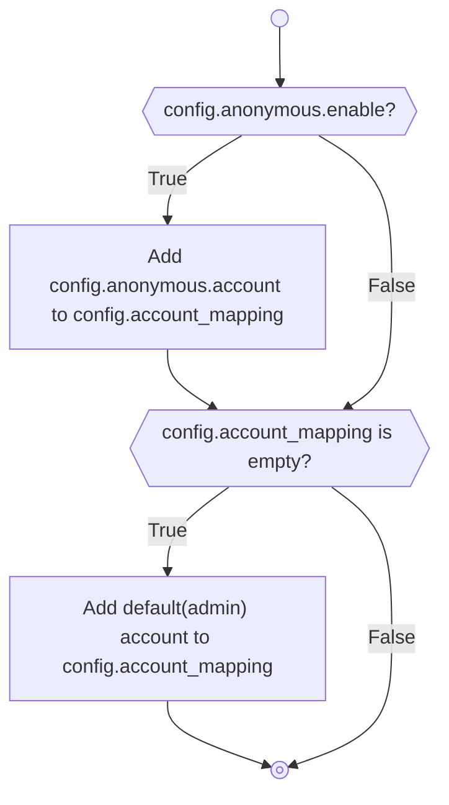
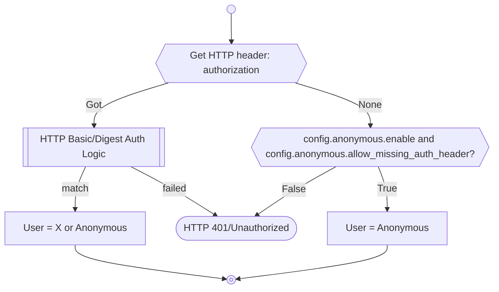

# Authentication

## Account Preprocessing

- If anonymous account are enabled, they will be automatically added to the list of accounts
- If can not found any account, the system will automatically add a default(admin) account.

## Match/Check Account

## Anonymous Account

More detail, please see howto.
