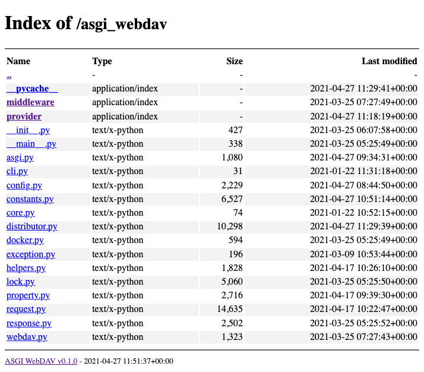

# 概览


[](https://codecov.io/gh/rexzhang/asgi-webdav)
[](https://github.com/psf/black)
[](https://lgtm.com/projects/g/rexzhang/asgi-webdav)
[](https://hub.docker.com/r/ray1ex/asgi-webdav)
[](https://github.com/rexzhang/asgi-webdav/releases)

一个基于 Python asyncio 的异步 WebDAV 服务端实现；支持多来源、多账号和权限控制等

## 特性

- 符合 [ASGI](https://asgi.readthedocs.io) 标准
- 符合 WebDAV 标准: [RFC4918](https://www.ietf.org/rfc/rfc4918.txt)
- 支持多来源: FileProvider, MemoryProvider
- 支持多账号以及权限控制
- 支持可选的家目录
- 支持将密码以 原始/hashlib/LDAP(试验性特性) 方式存储
- 完整的异步文件 IO
- 通过 WebDAV 官方的 [litmus(0.13)](http://www.webdav.org/neon/litmus) 测试, 仅有两个警告
- 可在浏览器中浏览文件目录
- 支持 HTTP Basic/Digest 认证
- 支持 Gzip/Brotli 压缩
- 兼容 macOS 访达/ Window10 Explorer [等客户端](https://rexzhang.github.io/asgi-webdav/compatibility/#compatible-clients)

## 简单尝试

```shell
docker pull ray1ex/asgi-webdav
docker run --restart always -p 0.0.0.0:8000:8000 \
  -v /your/data:/data \
  -e UID=1000 -e GID=1000 \
  --name asgi-webdav ray1ex/asgi-webdav
```

### 默认账号

|     | 值          | 说明       |
|-----|------------|----------|
| 用户名 | `username` | -        |
| 密码  | `password` | -        |
| 权限  | `["+"]`    | 允许访问所有目录 |

### 在浏览器列出文件目录


